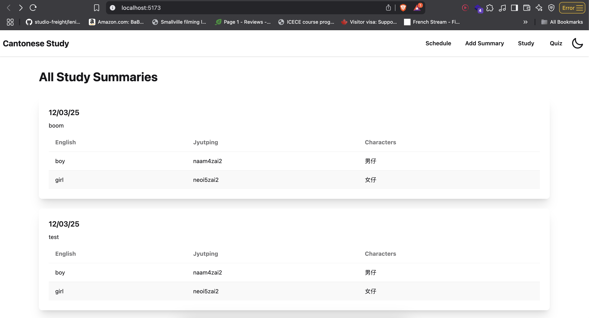
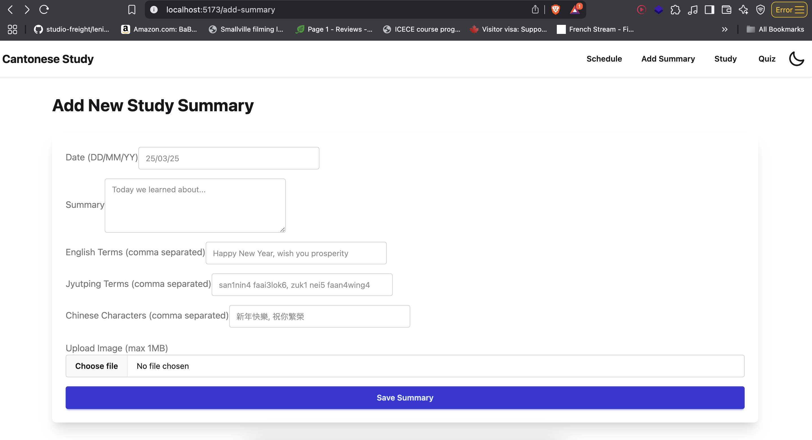
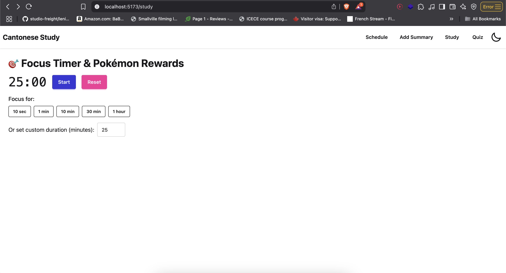
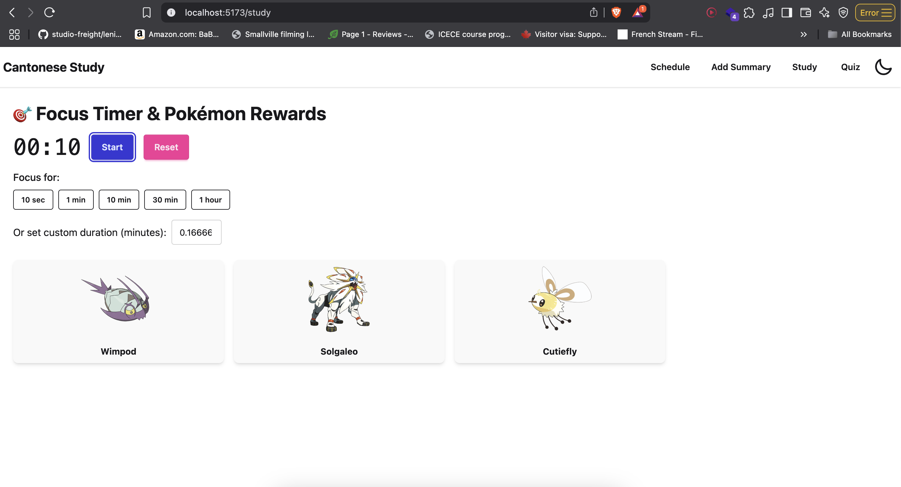
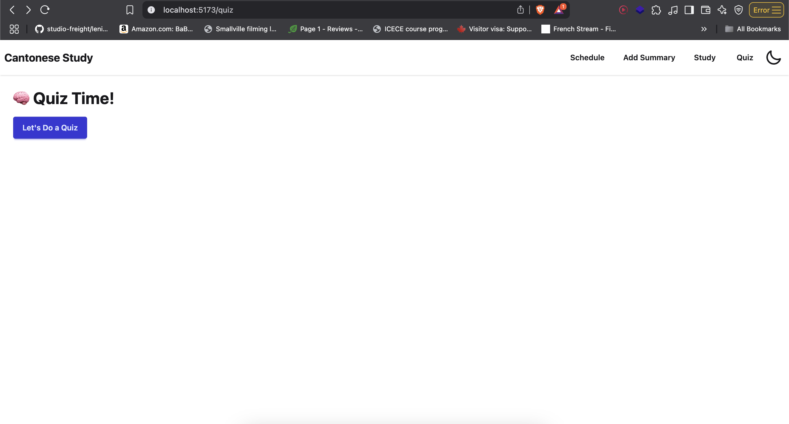
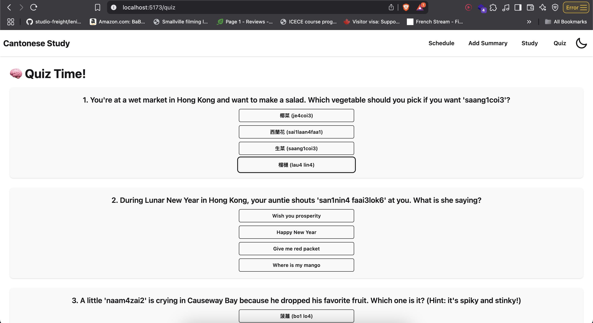

# 🥚 Egg Waffle — A Cantonese Language Learning App

**Egg Waffle** is a MERN-based web app designed to help users learn Cantonese through study sessions and quizzes. It supports Google OAuth authentication and Google Calendar integration for scheduling study time.

---

## 🚀 Features

- 🔐 Google Sign-In (coming soon)
- 📆 Google Calendar API integration (coming soon)
- ⏱ Study session timer
- 🧠 Quiz generator (Cantonese Jyutping)
- 📊 MongoDB-powered preference storage
- 🔎 Vocabulary-focused, gamified learning

---

## 🖼 App Screenshots

> Replace the image URLs below with actual screenshots of your app.

### 🏠 Dashboard  


### 🔐 Add summary Form  



### ⏱ Study Session with Timer  


### ⏱ Pokemon fetch after a Study Session 


### 🧠 Quiz Page  


### 🧠 Quiz Page - with Question Generated

---

## 🧩 Frontend

- **Framework**: React (Vite)
- **Routing**: React Router
- **Styling**: Tailwind CSS + DaisyUI
- **State Management**: useState, useEffect, Context API
- **OAuth**: Google Sign-In via Passport.js
- **Timer**: JavaScript-based interval timer with pause/reset support
- **Study Preferences**: Stored in Firebase Firestore (`userPreference` collection)

---

## 🔧 Backend

- **Runtime**: Node.js with Express.js
- **Authentication**: Passport.js (Google Strategy)
- **Database**: MongoDB (Mongoose)
- **Quiz Route**: `/api/quiz` generates Cantonese multiple-choice quizzes
- **Calendar API**: Integrates with Google Calendar to schedule study sessions
- **Quiz Source**: Predefined pool of vocabulary questions (randomly selected)

---
## 📡 API Used
### Pokemon API
https://pokeapi.co/

### Deepseek API
https://api-docs.deepseek.com/

---
## 📡 API Endpoints

### `GET /api/quiz`
Returns a random 10-question multiple-choice quiz.

**Response Example:**
```json
[
  {
    "question": "How do you say 'boy' in Jyutping?",
    "choices": ["naam4zai2", "neoi5zai2", "bo1lo4", "je4coi3"],
    "answer": "naam4zai2"
  }
]
